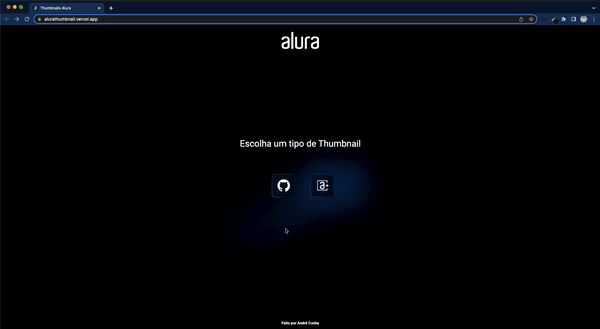

## Getting Started

Projeto inspirado no gerador de Thumbnail para o Github do [Eduardo Tioma](https://github.com/edukure/alura-github-thumbnail-generator). Essa versão também gera o Thumbnail para os Alura+ além do Github.

Site: [https://alurathumbnail.vercel.app/](https://alurathumbnail.vercel.app/)

<div align="center">
  
</div>

Para instalar as dependências do projeto, execute o comando abaixo:

```bash
npm install
```

Para rodar o projeto, execute o comando abaixo:

```bash
npm run dev
```

O projeto estará disponível em [http://localhost:3000](http://localhost:3000).

Feito com :heart: por [André Cunha](https://github.com/andreocunha)